# 小说工坊 Novel Studio · 产品介绍

> 本地优先的小说创作软件 ｜ 当前版本 **v1.0.18** ｜ Windows x64
> 项目主页：<https://github.com/linque0/novel> ｜ 安装程序：[Releases](https://github.com/linque0/novel/releases)
>
> **图文排版版**：[产品介绍-图文版.html](产品介绍-图文版.html) · [产品介绍-图文版.pdf](产品介绍-图文版.pdf)（24 页 A4，封面 / 目录 / 分章排版，适合直接分发或打印）

---

## 一、这是什么

**小说工坊**是一款面向个人作者的桌面写作软件：把「正文 / 大纲 / 人物 / 设定 / 灵感」五个创作要素收进同一个工作台，**输入即存、永不丢稿**，所有数据留在本机、不联网、不上传。

它要解决的是长篇小说创作中最常见的三个断裂：

| 创作痛点 | 小说工坊的做法 |
|---|---|
| 正文与大/小纲分离，写着写着失去结构 | 大纲做成**自由模块画布**，事件、便签、引用卡自由摆位并用连线表达因果；正文可拆窗与大纲并排 |
| 人物关系记在纸上、设定散在多个文档 | 人物有**关系图**，设定是**无限嵌套的幕布树**，二者都能与正文互相双链引用 |
| 心血丢失、版本混乱 | 输入防抖 1 秒自动落盘 + 30 秒兜底 + 失焦/切章/关窗强制保存；章节自动版本快照可回滚 |

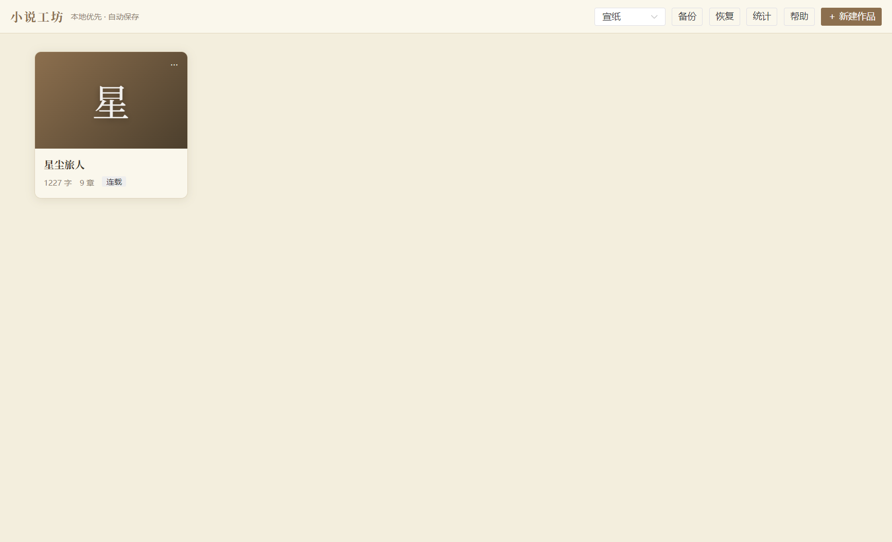

*书架页。每部作品一张封面卡，显示书名、总字数、章节数与连载状态；顶栏提供备份 / 恢复 / 统计 / 帮助与新建作品。*

---

## 二、正文：写作的主战场

正文区采用 **卷—章两级树 + 富文本编辑器**。左侧章节树支持拖拽排序与快捷操作（＋卷 / ＋章 / 上下移 / 改名 / 删除），右侧为 Word 风格工具栏：加粗、斜体、下划线、删除线，正文与 H1–H3 标题，字号、字体颜色、突出显示，超链接，左中右两端对齐，有序/无序列表与引用，撤销重做与清除格式。

写作时顶栏常驻保存状态点（「自动保存就绪 / 保存中… / 已保存 HH:MM:SS」），不必担心存盘问题。

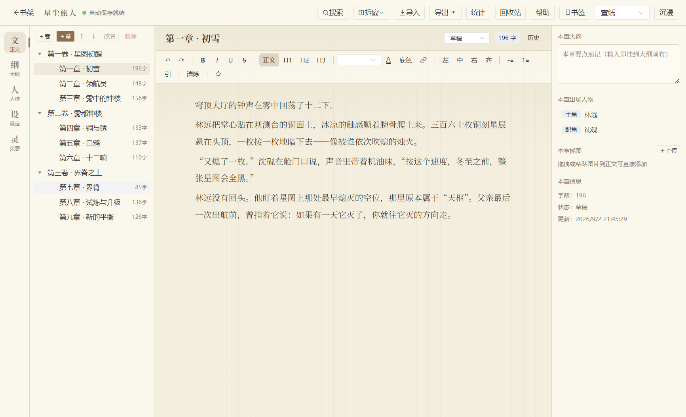

*正文工作台。右侧「本章大纲」「本章出场人物」「本章插图」「本章信息」随章节实时联动。*

### 右键即用：Word 式操作栏

在正文中右键会就地弹出快捷操作栏，把最常用的编辑动作一次摊开：剪切 / 复制 / 粘贴为纯文本、加粗斜体下划线删除线、标题与字号、字体颜色与突出显示、对齐（二级飞出菜单）、列表与引用、超链接、**添加双链**、撤销重做与全选。

细节上遵循 Word 习惯：右键落在选区**内**保持选区（菜单作用于选中文字），落在选区**外**则先把光标移到该处。剪贴板读写走安全 IPC。

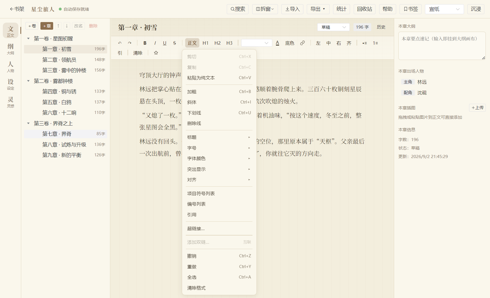

*正文右键菜单。「添加双链…」可把选中文字直接链到任意章节 / 人物 / 设定。*

---

## 三、大纲：自由模块画布

大纲是**流程图式白板**——没有固定结构，你把想法摆到哪里，它就是哪里。

### 模块与形状

可放置 **事件**（矩形 / 菱形 / 平行四边形 / 椭圆，SVG 描边真实形状）、**便签**、**引用卡**（双链到设定 / 章节 / 人物）、**文本框**（可调透明度）、**容器**（拖入即归组、拖出即回根级、可折叠）、**章节 / 卷锚点**（点击跳到正文对应位置）。

模块可拖拽摆位（网格吸附、双密度切换、pin 固定、八向调整尺寸），双击行内编辑。空白处右键即可新建，`Delete` / `Backspace` 删除选中模块。侧栏提供模块清单与类型筛选，点击定位、双向高亮。

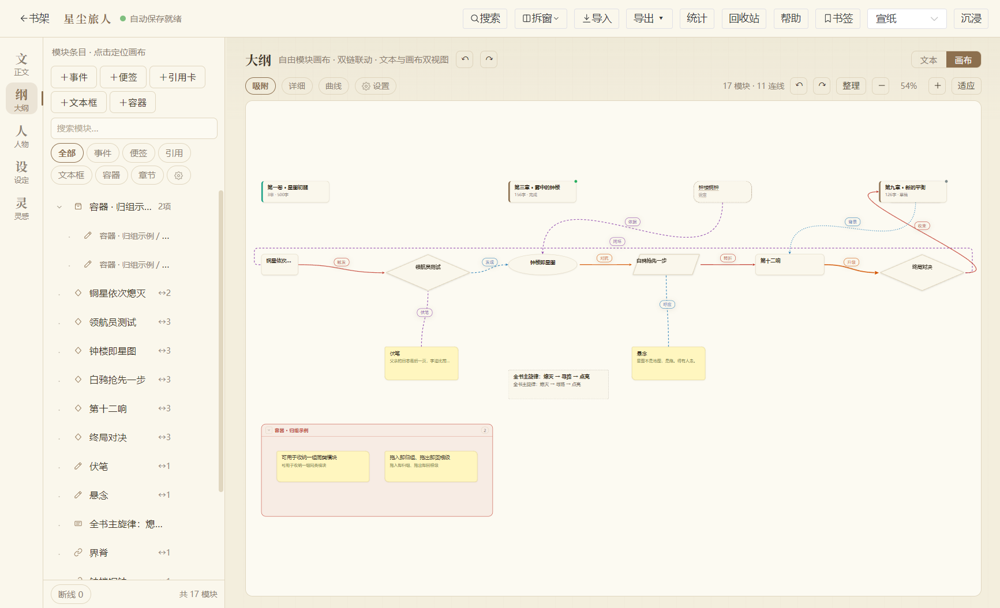

*大纲画布。左栏是模块清单与「断线」检测入口，画布上是三幕式结构：事件模块由四类连线串联成主链。*

### 连线：四类关系、严格端口、自动绕行

连线用四类语义着色——**关联**（蓝）、**因果**（红）、**伏笔**（紫，虚线）、**冲突**（橙）——并可独立设置单向 / 双向 / 无向箭头、实线 / 虚线 / 点线、线宽与箭头大小（既可全局默认，也可单条覆盖）。

两条工程上的硬保证：

- **严格端口锁定**：建立连线时记录两端的接口方向存库，渲染只认记录值——节点挪到任何位置，连线**绝不漂移**到别的边；
- **全局最短绕行**：连线途经任何模块（含两端节点本体）一律自动绕行，采用 **Hanan 稀疏网格 A\*** 求解全局最短路，再做直连 / L 形拉直收敛，无多余绕路与重复线段。

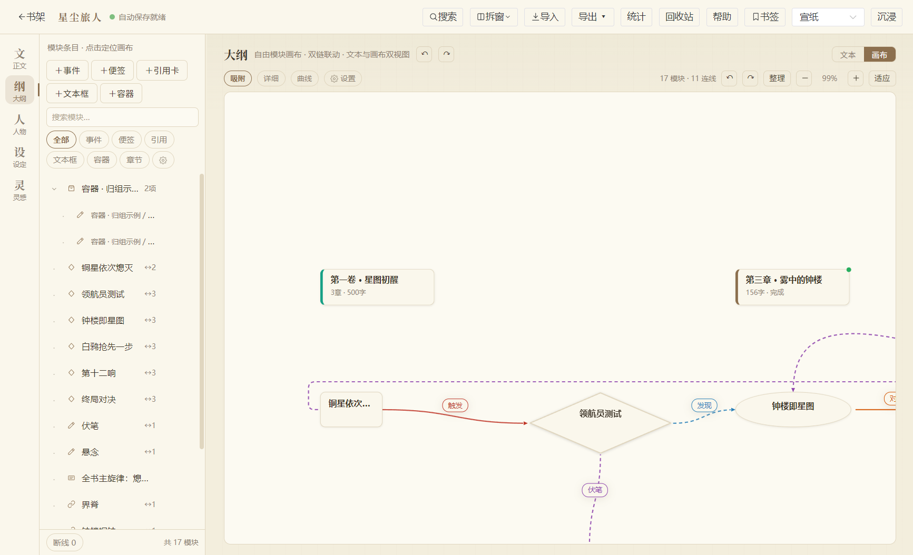

*放大后的画布。可见菱形事件、椭圆事件、带标签的连线（触发 / 发现 / 对抗），以及绕开节点自动走位的虚线。*

### 线连到线：连接点

除了「模块 ↔ 模块」，还支持**连线与连线互连**：从模块锚点拖线，若落点在既有连线上（12px 容差命中），会在落点自动创建一个**连接点**并完成接线。连接点是「连线寄生」模型——以路径参数 `t` 挂在宿主连线上，节点怎么挪都**钉在线上不脱线**；一条连线可建多个连接点、各自引出多条线。

连接点创建时有 1.6 秒高亮便于确认位置，之后淡出为微观透明（半径 2.5px、透明度 0.14），不遮挡线条；悬停时重新显形。

### 连线塑形与编辑

- **拖拽塑形**：左键按住连线拖动，连线随鼠标弯曲；拖回接近直线（垂距 < 6px）自动拉直，或**双击**直接拉直恢复自动路由；
- **右键编辑浮层**：标签、箭头方向、关系类型、线型、颜色、单条线宽与箭头大小、删除，以及「在此处创建连接点」。浮层会按上 / 下 / 左 / 右四方位**自动避开连线本体**落位，不遮住你正在改的那条线。

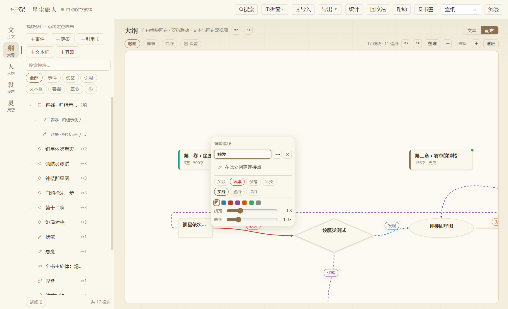

*右键连线打开编辑浮层：可改标签「触发」、关系类型（关联/因果/伏笔/冲突）、线型、颜色、线宽与箭头大小，并能就地创建连接点。*

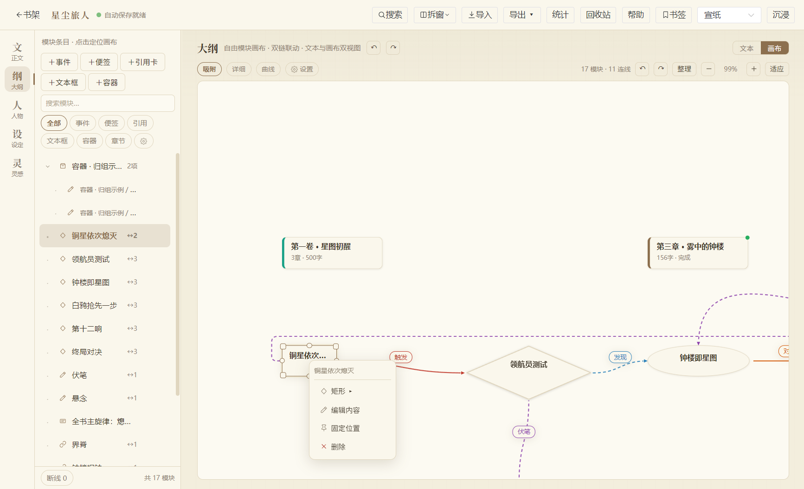

*右键模块弹出统一操作菜单：切换形状、编辑内容、固定位置、删除。*

### 文本视图：幕布式大纲

画布之外还有**文本视图**——把同一份大纲数据以缩进树呈现，适合快速罗列与调整层级。两个视图共享数据，随时切换。

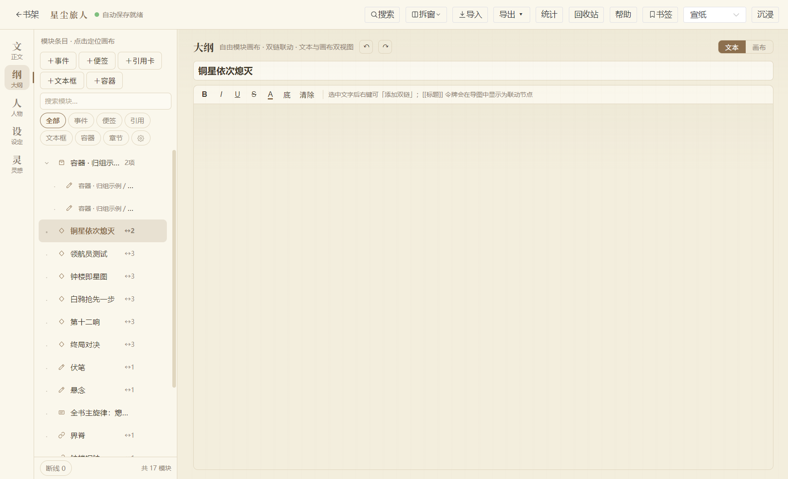

*文本视图。选中模块后可直接编辑标题与内容，并显示所属容器面包屑。*

---

## 四、人物：人物卡与关系图

人物模块同时提供**列表**与**关系图**两种视图。

### 关系图

人物是头像节点、关系是连线。可以直接在画布上**拖线建立关系**，点边就地改标签；支持圆形 / 网格一键排布、悬停高亮一度关系网、按角色或标签筛选、孤岛人物提示。拖线落到已有关系上则打开该关系的编辑浮层——**拖线既是「建立关系」也是「改变关系」的统一手势**。

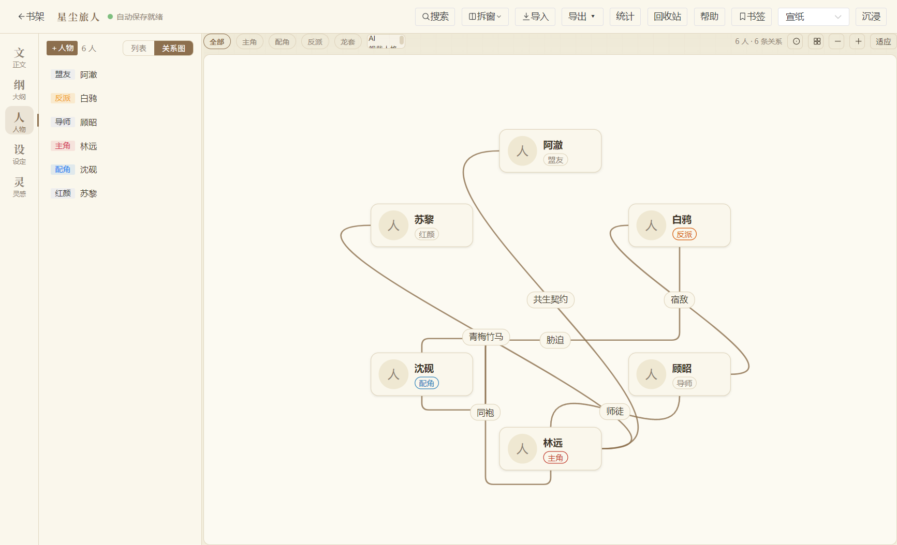

*关系图。《星尘旅人》六位人物的关系网：师徒、宿敌、青梅竹马、共生契约等一览无余。*

### 人物卡

列表视图是完整的人物档案：姓名、角色定位（8 个常见定位快捷胶囊：主角 / 配角 / 反派 / 导师 / 红颜 / 盟友 / 旁观者 / 龙套，也可自定义）、别名、标签、**自定义字段**（默认预置「外貌 / 性格」，可自由增删）、头像、人物小传，以及与其他人物关系的增删改。

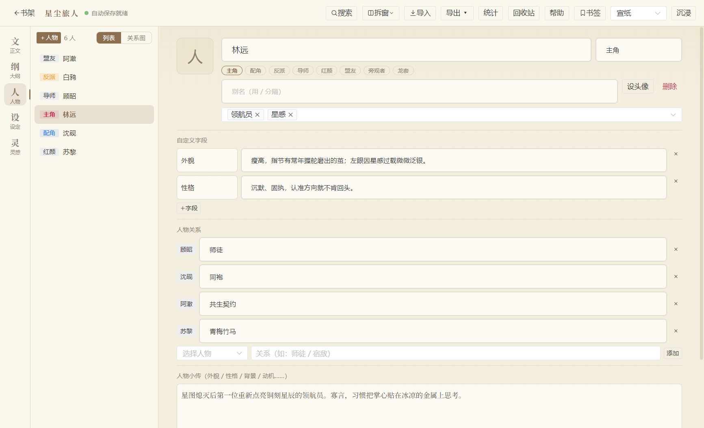

*人物卡。自定义字段、标签、人物关系（与关系图双向同步）与小传同页管理。*

---

## 五、设定：幕布式大纲树

设定库是一棵**统一节点树**：没有「文件夹 / 条目」二分，任意节点地位平等、可无限嵌套、自由拖拽（三区插入指示、悬停折叠节点自动展开、FLIP 衔接动画、拖到空白处移到顶层）。

节点内容支持内联格式（加粗 / 斜体 / 下划线 / 删除线 / 颜色 / 底色 / 清除格式），带快照式撤销重做，以及节点级复制 / 剪切 / 粘贴（纯文本优先）。侧边栏是同一棵树的镜像，点击定位、逐级折叠展开；支持 **MD / TXT 导入**——标题层级自动转成节点层级。

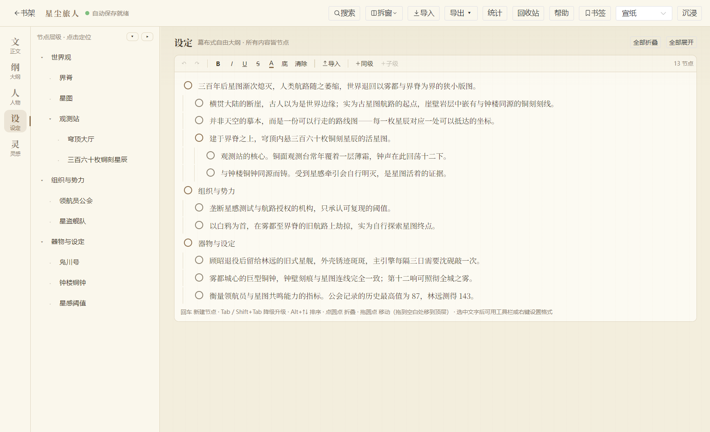

*设定幕布。左栏层级树与右侧编辑区双向同步，顶部为内联格式工具栏。*

---

## 六、灵感：随手记

灵感是一张随时可用的纸条：`Ctrl+Enter` 记下，一键转为章节或设定。写正文时冒出的念头不必打断思路。

*灵感列表。每条灵感可转为章节 / 设定，也可随时编辑或删除。*

---

## 七、全局工具

### 搜索 · 统计 · 双链

- **全局搜索**（`Ctrl+Shift+F`）：跨正文 / 大纲 / 人物 / 设定 / 灵感检索，命中高亮、点击跳转；
- **写作统计**：总字数、章节数、近 7 日新增、累计写作天数四张卡片，配近 90 天每日新增柱状图与近 180 天写作热力图（ECharts）；
- **双链系统**：任意位置选中文字 → 右键「添加双链…」或手输 `[[标题]]`，把章节 / 人物 / 设定互相引用；悬停链接可预览目标内容。

*全局搜索弹窗，可勾选检索范围。*

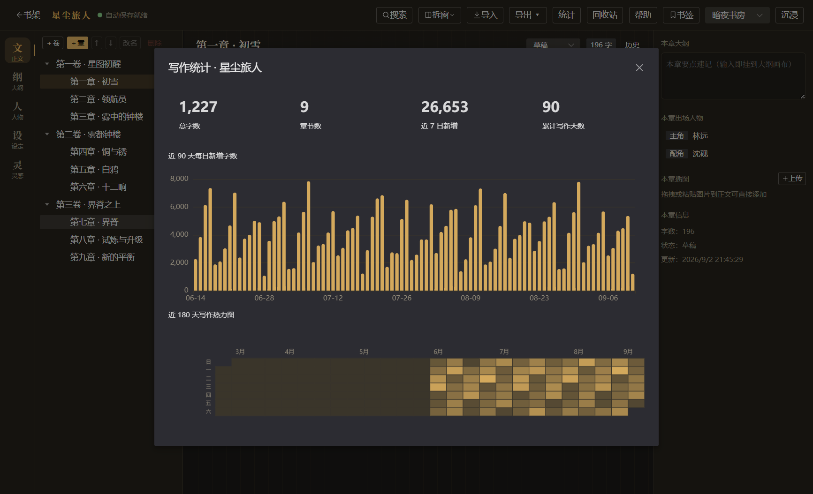

*写作统计（暗夜书房主题）。柱状图 + 热力图直观呈现写作节奏。*

### 导入与导出

**导入**支持 TXT / Markdown / DOCX / PDF / EPUB / 常见图片。TXT 自动识别 GBK 等编码并按「第 X 章」智能分章；DOCX 按标题样式分章；PDF 优先按书签目录分章；导入前有预览确认。

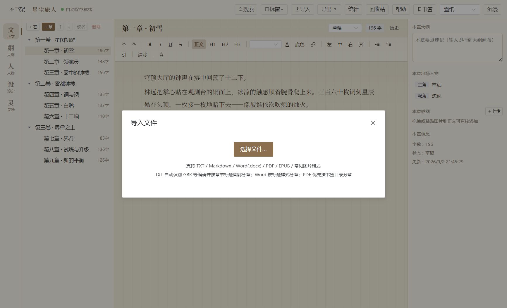

*导入弹窗，支持六类格式，导入前可预览分章结果。*

**导出**提供对话框按卷分组勾选章节，格式三选 **TXT 纯文本 / Markdown / Word (docx)**（docx 由 JSZip 手组 OOXML，保留加粗、标题、对齐、列表等基础语义，A4 版式）。批量策略随选中规模自动切换：

| 选中范围 | 导出行为 |
|---|---|
| 1 章 | 直接以 `章节名.格式` 导出 |
| 多章（≤ 阈值，默认 30） | 逐章分批：仅首次确认位置，之后自动写入同目录，每章一个文件 |
| 超过阈值 | 可选「合并为单个文件」或「按章打包 zip」（按卷分目录、`序号-章节名` 命名） |

阈值 2–500 可调，即改即存。

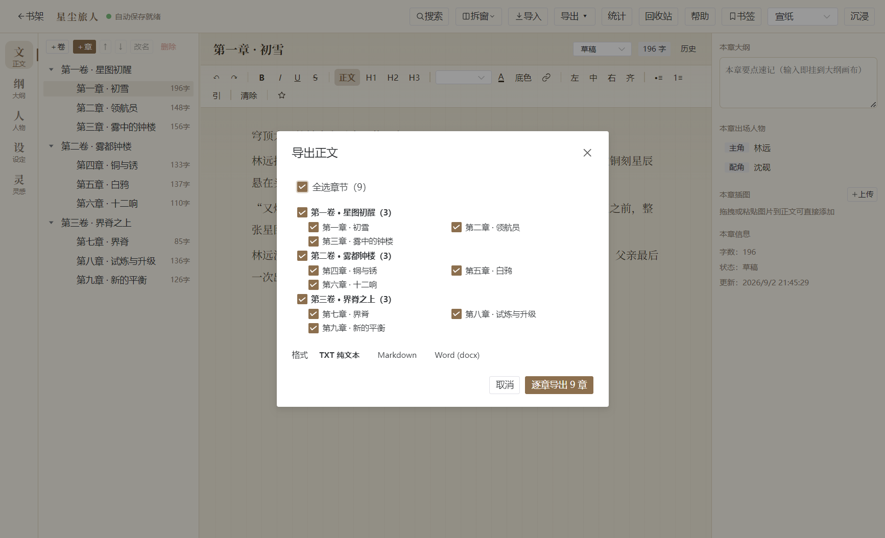

*导出对话框。按卷分组勾选章节，底部选择格式；按钮文字会随选中章数变化（此处为「逐章导出 9 章」）。*

---

## 八、多窗口：边看大纲边写正文

顶栏「⧉ 拆窗 ▾」可把**正文 / 大纲 / 人物 / 设定 / 灵感**任一模块拆出为**完整功能界面的独立窗口**（侧栏 + 编辑区 + 调宽手柄），面板内可自由切换条目——不是只读预览，而是完整的第二编辑现场。

为防同一内容被两个窗口同时改写，软件内置**实体锁**：面板占用的章节，主窗口该章转为**只读占位**并给出「前往窗口」按钮，其余章节照常可写；面板内切换条目时锁**随选中迁移**。面板按类型记忆窗口几何，主窗口关闭时级联关闭全部面板。

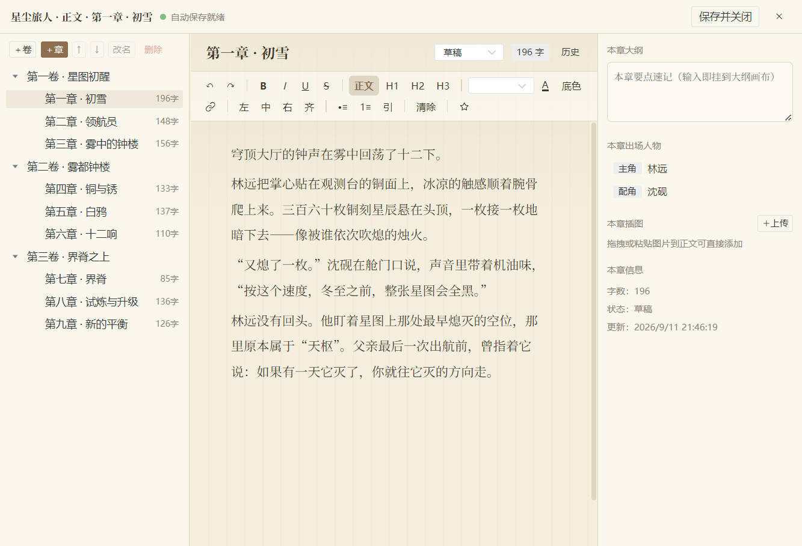

*拆出的正文面板窗口。顶部是「保存并关闭」，左栏可自由切换任意章节。*

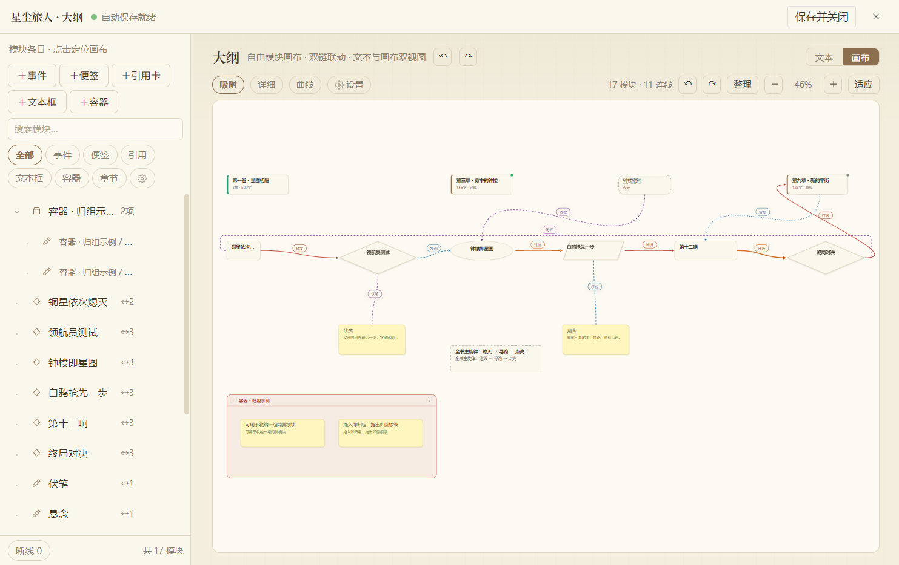

*拆出的大纲面板窗口，完整保留画布与工具栏。*

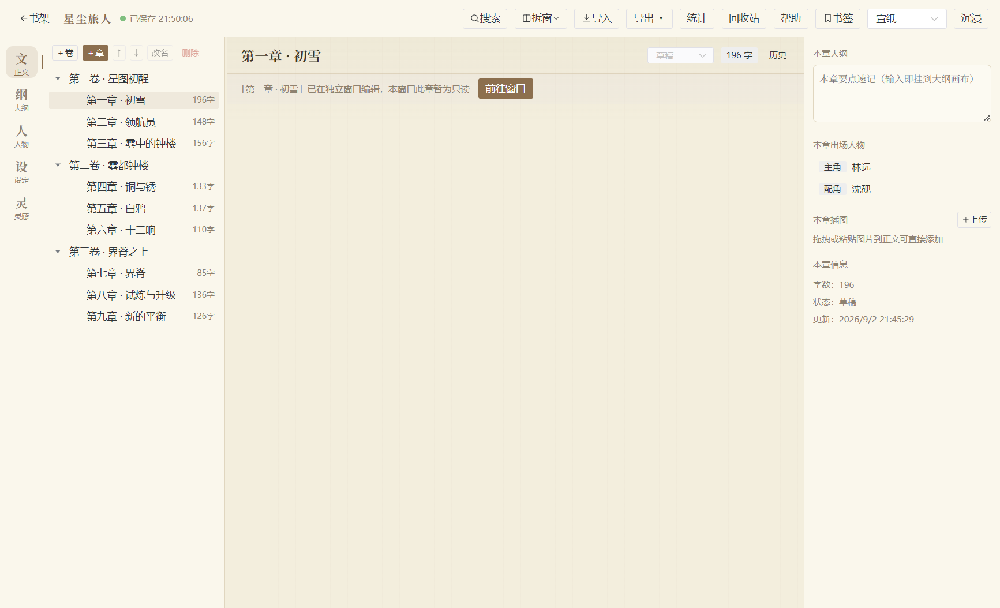

*正文被面板占用时，主窗口对应章节显示只读占位与「前往窗口」跳转，避免双写。*

---

## 九、视觉与主题

三套皮肤：**宣纸**（默认，暖米色纸纹）、**羊皮纸**、**暗夜书房**（深色）。全局采用衬线排版与纸张纹理，配 OIcon 内联 SVG 图标体系与统一的视觉令牌（圆角、间距、投影、动效时长）。

另有**沉浸模式**：隐藏侧栏与导航栏，只留正文，专注写作。导航栏底部一键昼夜切换。

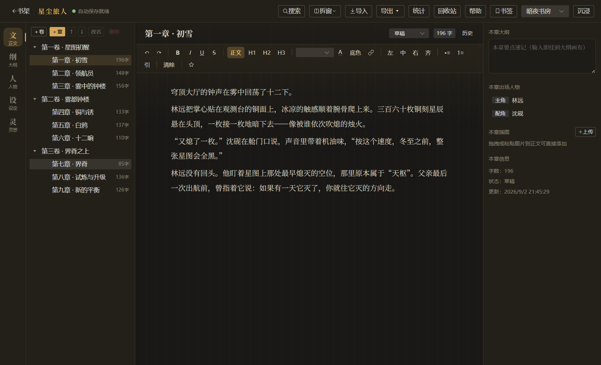

*暗夜书房主题下的正文视图。*

---

## 十、内置帮助与数据安全

顶栏「帮助」按钮（书架页与书内均有）打开**内置使用手册**——手册与源码同源打包（Markdown 以 raw 导入 + marked 渲染），包含功能详解、**键位详解**、导出行为表与 FAQ，永不失同步。

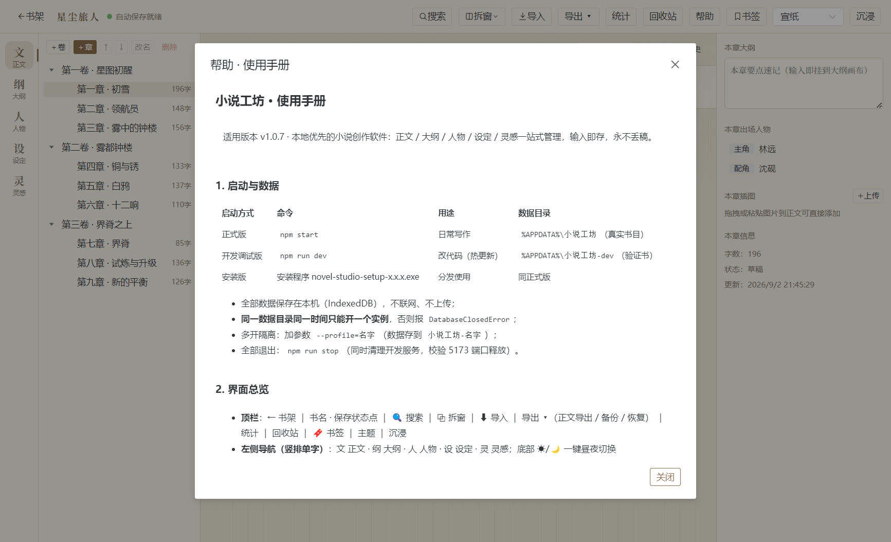

*内置使用手册弹窗，含键位详解与导出详解。*

删除的章节 / 人物 / 设定 / 灵感进入**回收站**，可恢复或彻底删除。

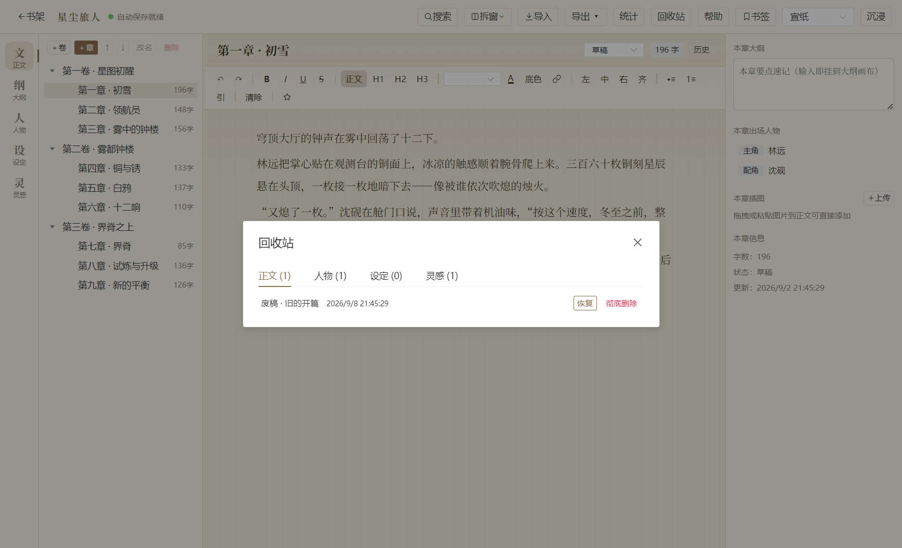

*回收站按类型分页，支持恢复与彻底删除。*

**数据与安全**：

- 所有数据存于本机（Electron 用户数据目录下的 IndexedDB），**无任何网络请求**，不登录、不上传；
- 菜单「备份」导出 JSON 全库快照（含图片），「恢复」可整体还原；
- 超链接仅接受公网 http/https 地址（拒绝本地 / 私有 / 保留 IP），点击时交由系统默认浏览器打开；
- 同一数据目录同时只允许一个实例运行，后启动者给出提示且不损坏数据；需要多开时用 `--profile=名字` 隔离数据目录。

---

## 十一、安装与运行

| 形态 | 获取方式 | 说明 |
|---|---|---|
| **安装程序** | [Releases](https://github.com/linque0/novel/releases) 下载 `novel-studio-setup-1.0.18.exe` | Windows x64，NSIS 向导式（可选安装路径、创建桌面与开始菜单快捷方式） |
| **免安装本体** | `npm run dist` 产物 `release2/win-unpacked/小说工坊.exe` | 双击直接运行 |
| **源码运行** | `npm install && npm start` | 开发者方式（需 Node.js ≥ 18） |

安装程序未做代码签名，首次运行如遇 SmartScreen 提示，选「更多信息 → 仍要运行」即可。

---

## 十二、技术一览

| 项 | 内容 |
|---|---|
| 形态 | Windows 桌面应用（Electron），本地优先、离线可用 |
| 前端 | Electron 33 + Vue 3 + Pinia + Naive UI |
| 编辑器 | TipTap 富文本（正文）、自研幕布编辑器（设定 / 大纲文本）、自研画布引擎（大纲 / 人物关系图） |
| 存储 | Dexie / IndexedDB，Repository 层隔离（后续可平滑迁移 SQLite） |
| 图表 | ECharts |
| 打包 | electron-builder（NSIS 安装程序 + 免安装目录，maximum 压缩） |
| 规模 | 51 个源码文件（31 个 Vue 组件）、约 1.54 万行源码 |
| 质量 | 17 套 CDP 端到端验收脚本、179 项断言，随版本入库 |

功能与版本演进详见 [CHANGELOG.md](../CHANGELOG.md)；开发方法与工程纪律见 [开发流程.md](开发流程.md)；面向使用者的操作说明见 [使用手册.md](使用手册.md)。
